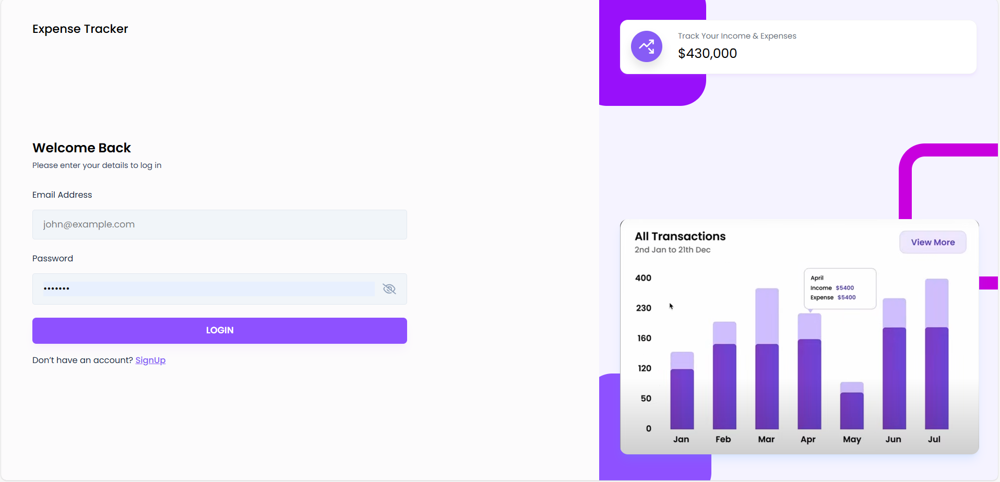
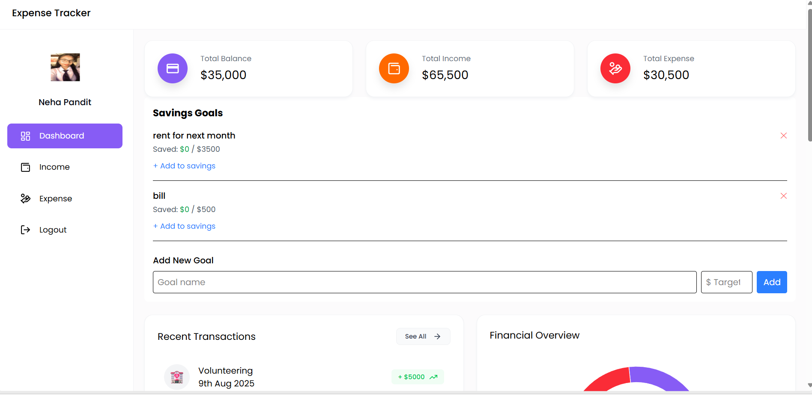
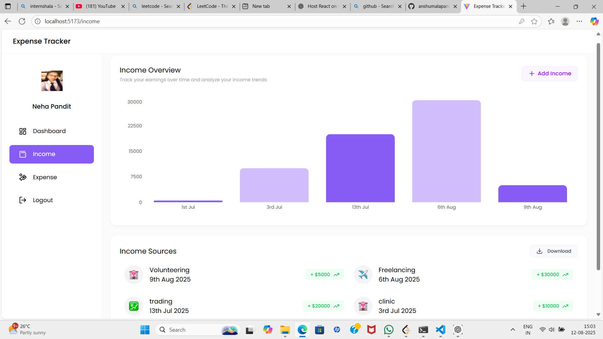
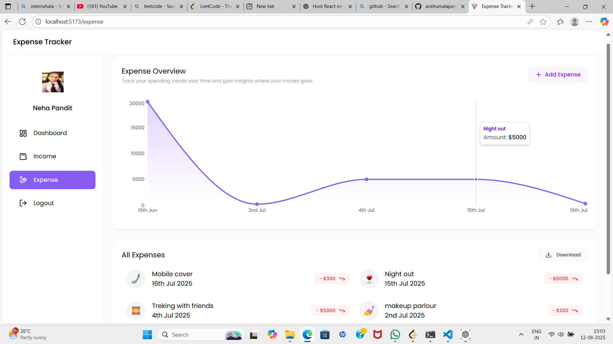
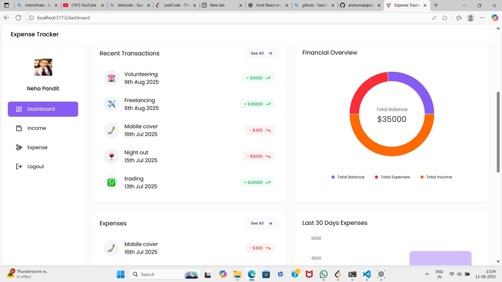

# Expense-Tracker-Project 🚀

> A modern web application built with **React** (frontend) and **Node.js / Express** (backend), designed to deliver high performance and scalability.

---

## ✨ Features
- 🎯 Fully responsive and intuitive UI developed with React for seamless user experience
- ⚡ High-performance backend powered by Node.js and Express ensuring fast data processing
- 🔒 Robust and secure user authentication to protect personal financial data
- 📦 Efficient state management using Redux / Context API for smooth application flow
- 💰 Dynamic income and expense management: users can add, edit, and delete records effortlessly
- 🎯 Customizable savings goals (e.g., monthly home bill, power bill) to promote disciplined saving habits
- 📊 Advanced financial overview with interactive charts displaying income trends (last 30 days) and expense patterns (last 60 days)
- 📈 Comprehensive dashboard visuals that provide actionable insights into users’ financial health

---

## 🛠 Tech Stack
**Frontend:** React, JavaScript, Tailwind CSS, Bootstrap
**Backend:** Node.js, Express, MongoDB 
**Version Control:** Git & GitHub  
**Deployment:** Vercel 

---

## ⚙️ Installation
```bash
# Clone the repository
git clone https://github.com/username/repository-name.git

# Navigate to frontend folder
cd frontend
npm install

# Navigate to backend folder
# Start backend
cd backend
npm start
---
```
## 🎯 Screenshots
### 1️⃣ Login Page  
  

### 2️⃣ Home Page  
  

### 3️⃣ Income Page  
  

### 4️⃣ Expense Page  
  

### 5️⃣ Dashboard Visuals  
  

## 🚀 Will add more features soon..
 Add user roles & permissions,
 Implement dark mode,
 Add real-time notifications,alerts ,warning.
 Chatbot that suggest smart managing of income . etc

## 🤝 Contributing
Pull requests are welcome. For major changes, please open an issue first.
